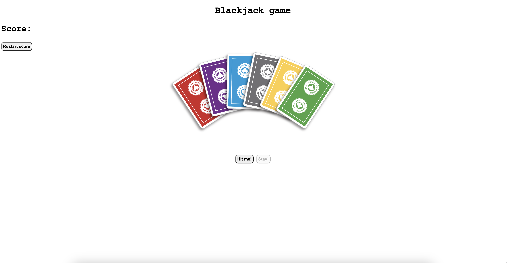
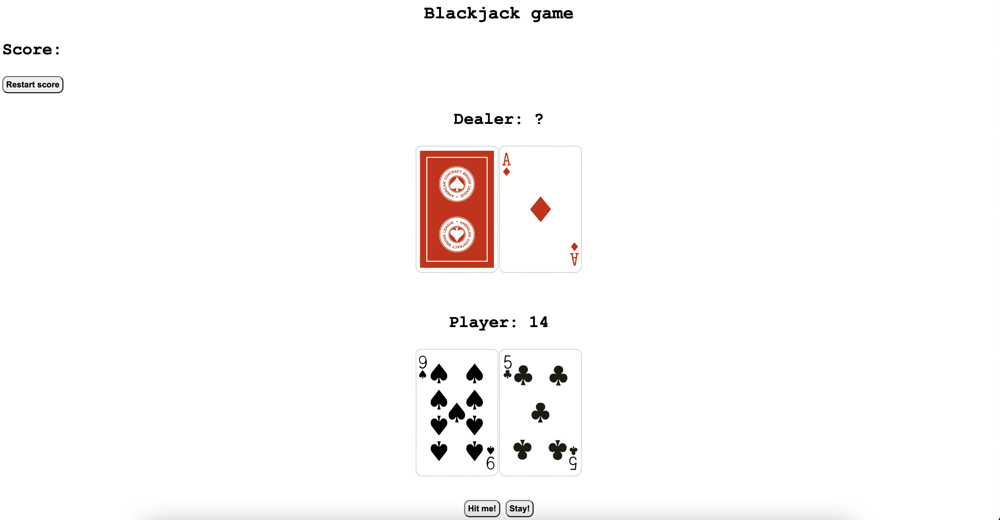
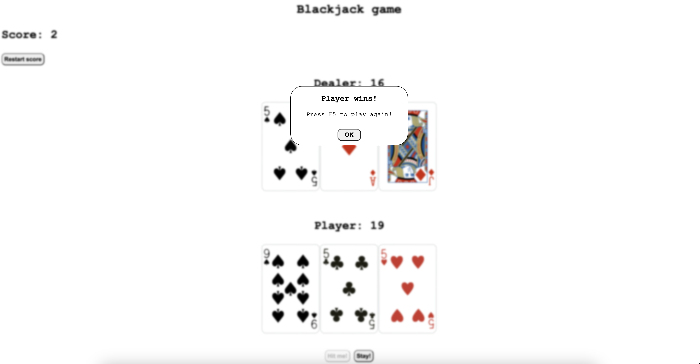

# ♠️ Blackjack Game ♣️

Welcome to the Blackjack game! 🚀 In this classic card game, you'll test your luck and skills against the dealer. Can you beat the house and get closer to 21 without busting?

## How to Play

1. The goal of Blackjack is to have a hand value as close to 21 as possible without exceeding it.
2. Each player is dealt two cards. Number cards are worth their face value, face cards (Jack, Queen, King) are worth 10, and Aces can be worth 1 or 11, depending on which value benefits the hand.
3. After receiving your initial hand, you have the option to "Hit" (draw another card) to increase your hand value or "Stand" (keep your current hand value).
4. If your hand exceeds 21, you bust and lose the round.
5. The dealer then reveals their hand and follows a specific set of rules for drawing cards.
6. The player with a hand value closest to 21 without exceeding it wins the round.

## Try the Live Demo

Check out the live demo of the Blackjack game [here](https://morohoschidanieli.github.io/blackjack-game/). 🌐

## Screenshots

## Technologies Used

The Blackjack game is built using the following technologies:

- HTML, CSS, and JavaScript: For creating the user interface and game logic.
